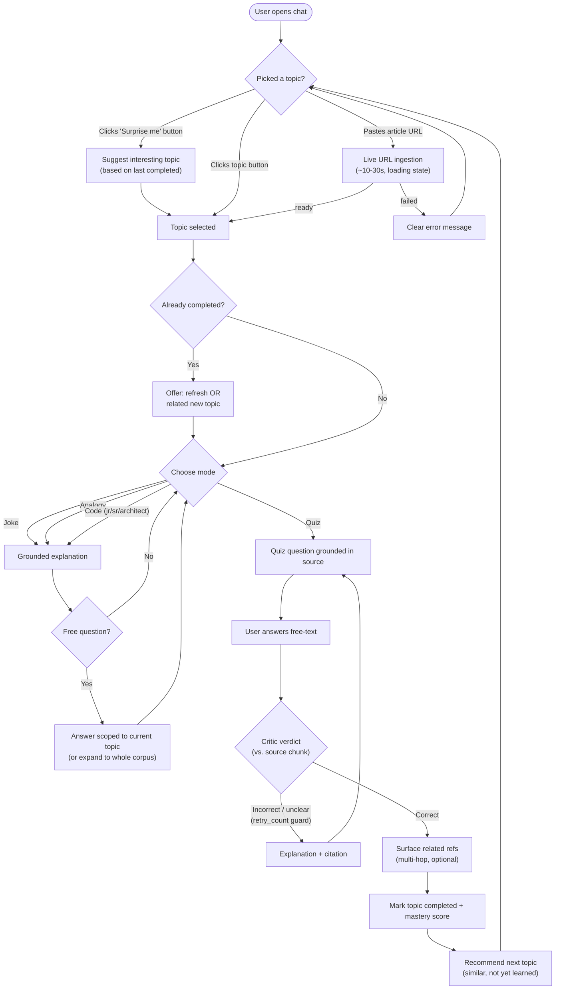
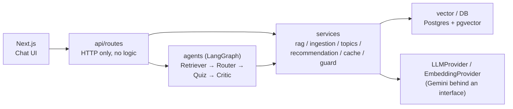
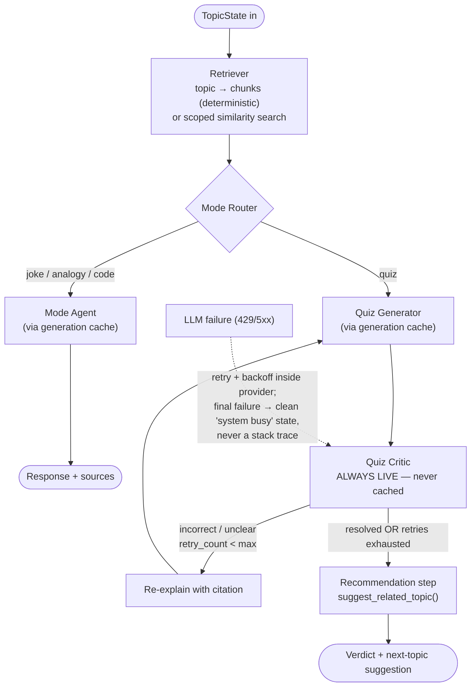
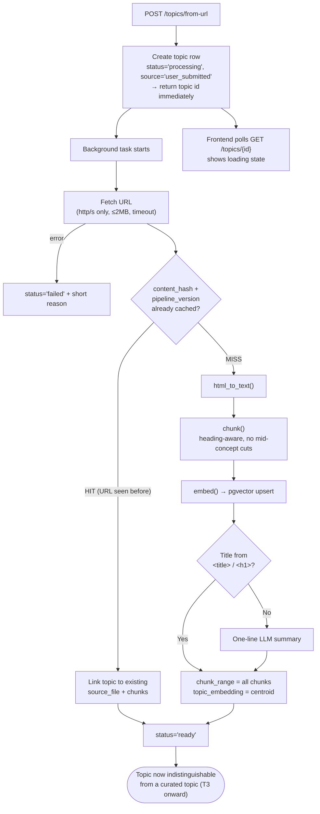
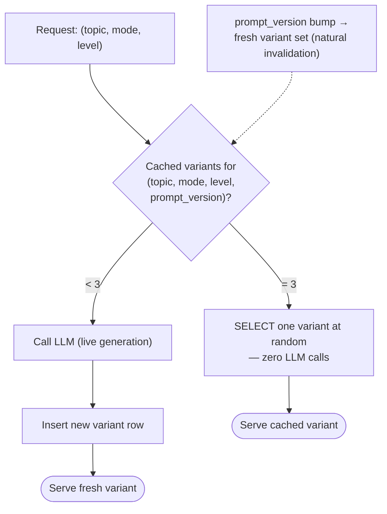
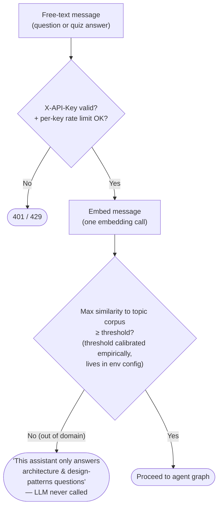
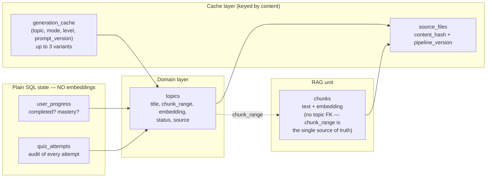

# System Flow Diagrams — Architecture-is-Cool

Companion to `TASKS.md` — each diagram maps to the task topics that implement it
(referenced as **T1-T13**). Diagrams are Mermaid; GitHub renders them inline.

---

## 1. Big Picture — User Journey (end to end)

What the user experiences, from entry to "next topic". Covers T3, T4, T6, T7, T9, T12.

---

## 2. Request Path Through the Layers (Modular Monolith)

Every request follows this one-directional chain — no layer skips. Covers T1, T5, T12.

Rule: `routes` never touch DB/LLM directly; `agents` never touch the DB directly.
Swapping Gemini for another provider = config change only.

---

## 3. Agent Graph — Core Loop (LangGraph)

The explicit state machine (`TopicState` shared between nodes). Covers T5, T6, T7, T9.

**Critic rule (critical):** an answer that is plausibly right but not covered by the
source chunk gets verdict `unclear` with an honest "the source doesn't address this" —
**never** a false `incorrect`.

---

## 4. User-Submitted URL Ingestion (F1.5)

Same pipeline as the seed corpus, triggered over HTTP. Covers T2, T4.

Invariant: a topic is never left in `processing` after the task ends — it's `ready` or
`failed`, nothing in between.

---

## 5. Generation Cache — Lazy, Capped, Rotating (cost control)

Applies to explanations and quiz questions. The Critic is **never** cached. Covers T10.

Effect: LLM cost is bounded by `topics × modes × levels × 3` regardless of user count —
a ~100-user demo costs under $1 (only live Critic calls scale with users).

---

## 6. Free-Text Message Guard (security / quota protection)

Runs before any free-text input reaches the LLM. Button clicks skip it. Covers T11.

---

## 7. Data Model at a Glance

Which table answers which question. Covers T1, T2, T3, T9, T10.

**The separation to protect:** `user_progress` answers a lookup question ("done?
yes/no") — recommendations are the *only* place embedding similarity is used.

---

## Diagram → Task Topic Map

| Diagram | Implements | TASKS.md topics |
|---|---|---|
| 1. User journey | The whole product experience | T3, T4, T6, T7, T8, T9, T12 |
| 2. Layer path | Module boundaries | T1, T12 |
| 3. Agent graph | Core loop + failure handling | T5, T6, T7, T9 |
| 4. URL ingestion | F1.5 end to end | T2, T4 |
| 5. Generation cache | Cost control | T10 |
| 6. Free-text guard | Security + quota | T11 |
| 7. Data model | All persistence decisions | T1, T2, T3, T9, T10 |
